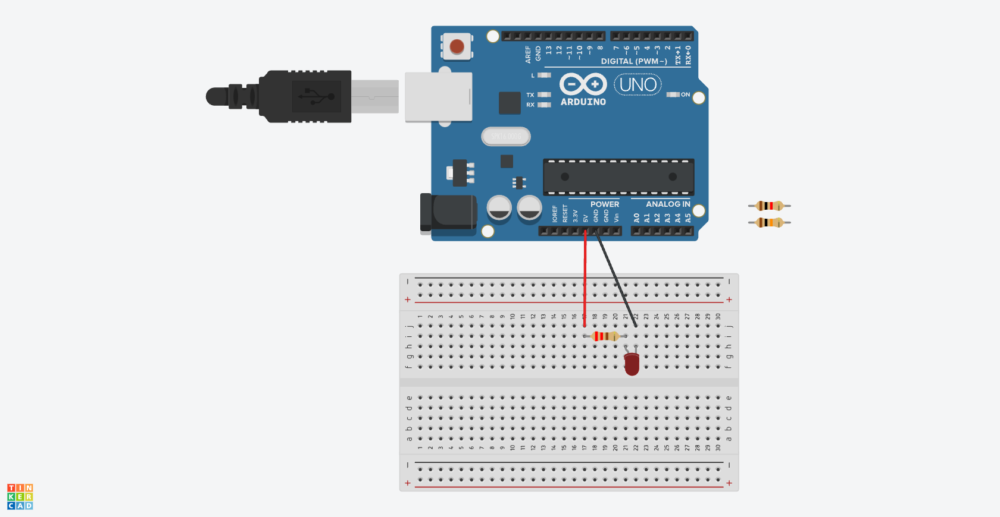

# Chapter1(LED点灯)

## 概要

Arduinoを使ってLEDを点灯させる。

## 必要な部品

- Arduino Uno R3 x1
- breadboard x1
- M-M jumper wire x2
- 5mm red LED x1
- 220Ω resistor x1
- 1kΩ resistor x1
- 10kΩ resistor x1

## 回路図

## 動作

このプロジェクトでは、Arduinoを使ってLEDを点灯させた。

5Vピンから220Ωの抵抗を通してLEDのアノードに接続し、カソードをGNDに接続することでLEDを点灯させた。

このプロジェクトでは、220Ω、1kΩ、10kΩの抵抗を使ってLEDを点灯させた。それぞれでLEDの明るさが変わることを確認した。
