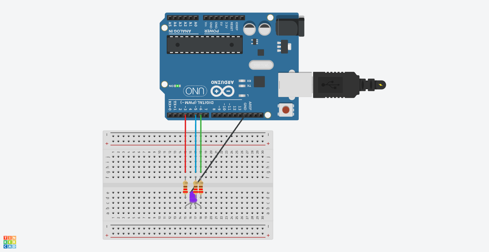

# Chapter2(RGB LED点灯)

## 概要

Arduinoを使ってRGB LEDを点灯させる。

## 必要な部品

- Arduino Uno R3 x1
- breadboard x1
- M-M jumper wire x4
- RGB LED x1
- 220Ω resistor x1

## 回路図



## プログラム

```cpp
#define RED 3
#define BLUE 5
#define GREEN 6
#define DELAYTIME 10

void setup()
{
  pinMode(RED, OUTPUT);
  pinMode(GREEN, OUTPUT);
  pinMode(BLUE, OUTPUT);
  digitalWrite(RED, HIGH);
  digitalWrite(GREEN, LOW);
  digitalWrite(BLUE, LOW);
}

int redValue;
int greenValue;
int blueValue;

void loop()
{

  redValue = 255;
  greenValue = 0;
  blueValue = 0;

  for(int i = 0; i < 255; i += 1)
  {
    redValue -= 1;
    greenValue += 1;
    analogWrite(RED, redValue);
    analogWrite(GREEN, greenValue);
    delay(DELAYTIME);
  }

  redValue = 0;
  greenValue = 255;
  blueValue = 0;

  for(int i = 0; i < 255; i += 1)
  {
    greenValue -= 1;
    blueValue += 1;
    analogWrite(GREEN, greenValue);
    analogWrite(BLUE, blueValue);
    delay(DELAYTIME);
  }

  redValue = 0;
  greenValue = 0;
  blueValue = 255;

  for(int i = 0; i < 255; i += 1)
  {
    blueValue -= 1;
    redValue += 1;
    analogWrite(BLUE, blueValue);
    analogWrite(RED, redValue);
    delay(DELAYTIME);
  }
}


```

## 動作

このプロジェクトでは、Arduinoを使ってRGB LEDを点灯させた。

RGB LEDは、赤、緑、青の3色のLEDが1つにまとめられたもので、それぞれのLEDを点灯させることで様々な色を表現できる。

赤のピンを3番、緑のピンを5番、青のピンを6番に接続し、それぞれのピンにPWM信号を出力することで、RGB LEDを点灯させた。
