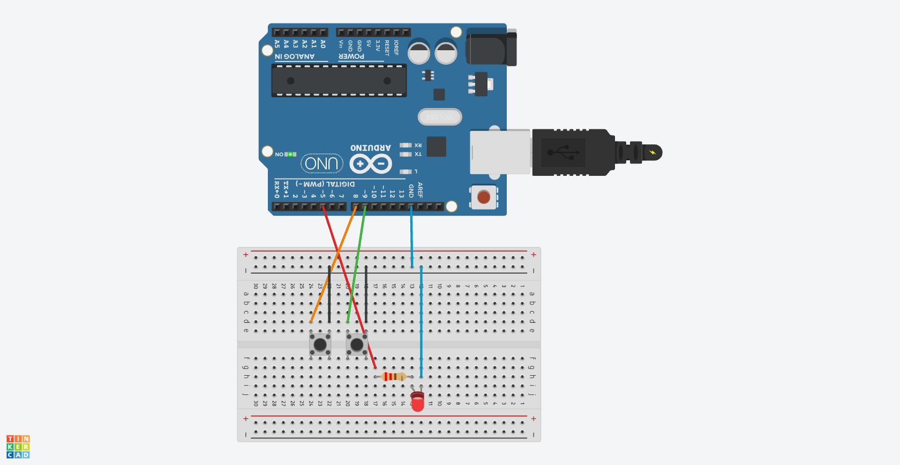

# Chapter3(デジタル入力)

## 概要

スイッチを利用してデジタル入力について学びつつ、LEDを点滅させる。

## 必要な部品

- Arduino Uno R3 x1
- breadboard x1
- M-M jumper wire x7
- 5mm red LED x1
- 220Ω resistor x1
- push switch x2

## 回路図



## プログラム

```cpp
int ledPin = 5;
int buttonApin = 8;
int buttonBpin = 9;

void setup() 
{
  pinMode(ledPin, OUTPUT);
  pinMode(buttonApin, INPUT_PULLUP);  
  pinMode(buttonBpin, INPUT_PULLUP);  
}

void loop() 
{
  if (digitalRead(buttonApin) == LOW)
  {
    digitalWrite(ledPin, HIGH);
  }
  if (digitalRead(buttonBpin) == LOW)
  {
    digitalWrite(ledPin, LOW);
  }
}
```

## 動作

このプロジェクトでは、スイッチを使ってLEDを点灯させた。

スイッチAを押すとLEDが点灯し、スイッチBを押すとLEDが消灯する。

## 注意事項

プログラムでは、INPUT_PULLUPを使って内部プルアップ抵抗付きの入力を行っている。

この回路では、スイッチが押されたときの判定はLOWを利用して行う。イメージを逆になることに注意が必要である。
