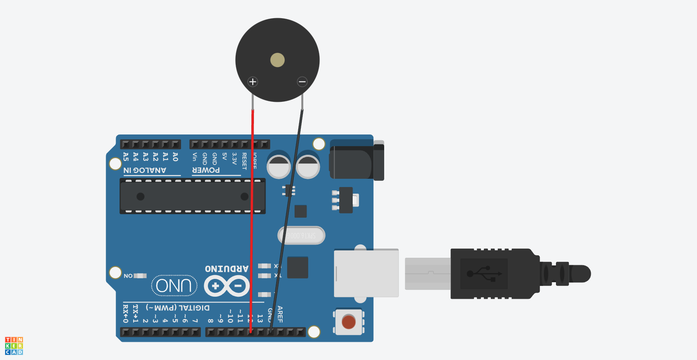

# Chapter4(アクティブブザー)

## 概要

アクティブブザーを鳴らす

## 必要な部品

- Arduino Uno R3 x1
- F-M wires x2
- Active Buzzer x1

## 回路図



## プログラム

```cpp
int buzzer = 12;

void setup()
{
 pinMode(buzzer,OUTPUT);
}

void loop()
{
 digitalWrite(buzzer, HIGH);
 delay(1);
 digitalWrite(buzzer, LOW);
 delay(1);
} 
```

## 動作

このプログラムを動作させると、アクティブブザーが鳴り続けた。

本プログラムでは、HIGHとLOWを1msずつ繰り返し、アクティブブザーを鳴らした。1msでは非常に周波数の高い音が鳴り、この間隔を変更することで音の高さを変えることができる。
