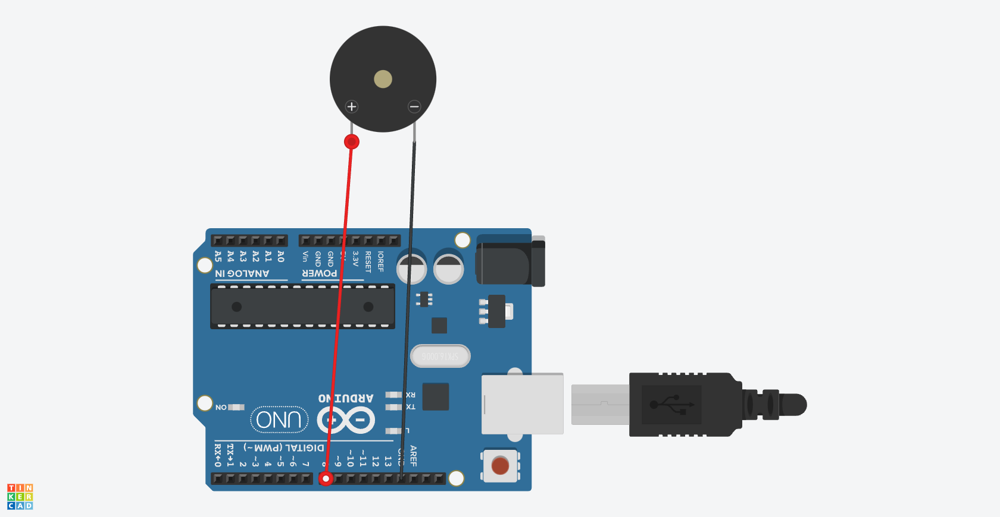

# Chapter5(受動ブザー)

## 概要

受動ブザーを鳴らす

## 必要な部品

- Arduino Uno R3 x1
- F-M wires x2
- Passive Buzzer x1

## 回路図



## プログラム

```cpp
#include "pitches.h"

#define SIZE 8

int buzzer = 8;
int melody[] = {
  NOTE_C5, NOTE_D5, NOTE_E5, NOTE_F5, NOTE_G5, NOTE_A5, NOTE_B5, NOTE_C6};
int duration = 500;
 
void setup() {
 
}
 
void loop() {  
  for (int thisNote = 0; thisNote < SIZE; thisNote++) {
    tone(buzzer, melody[thisNote], duration);
     
    delay(1000);
  }
   
  delay(2000);
}
```

## 動作

このプログラムを動作させると、受動ブザーをドレミファソラシドで鳴らすことができた。

```cpp
tone(buzzer, melody[thisNote], duration);
```

の第一引数にどのピンから出力するのか、第二引数で何Hzの音を出力するのか、第三引数でどのくらいの時間(ms)音を出力するのかを指定している。

## 注意事項

受動ブザーは[アクティブブザー](../Chapter4/README.md)と違い、PWM信号を使って音を出力する。

このプログラムでは、[pitches.h](./pitches.h)を使って音階を定義している。このファイルは同フォルダに定義している。
