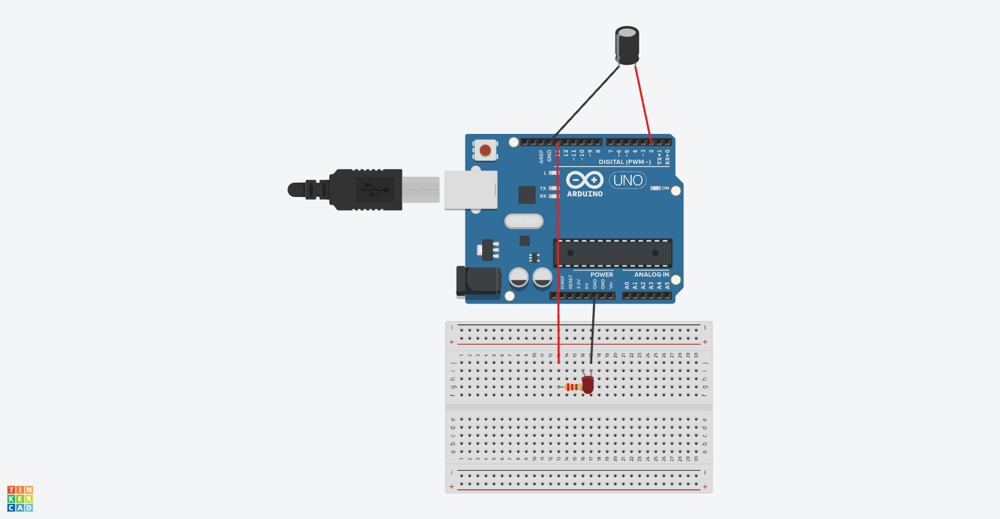

# Chapter6(傾斜ボールスイッチ)

## 概要

傾きを検出する

## 必要な部品

- Arduino Uno R3 x1
- Tilt Ball switch x1
- F-M wires x2

## 回路図



## プログラム

```cpp
int ledPin = 13;

void setup()
{ 
  pinMode(ledPin,OUTPUT);
  pinMode(2,INPUT);
  digitalWrite(2, HIGH);
} 

void loop() 
{  
  int digitalVal = digitalRead(2);
  if(digitalVal == HIGH)
  {
    digitalWrite(ledPin,LOW);
  } else {
    digitalWrite(ledPin,HIGH); 
  }
}
```

## 動作

このプログラムを動作させ、ボールスイッチを上方向へ傾けるとLEDが光り、それ以外に向けるとLEDが消えることが確認できた。

## 注意事項

回路図では、ボールスイッチの図がなかったため、有極コンデンサの図で代用している。
