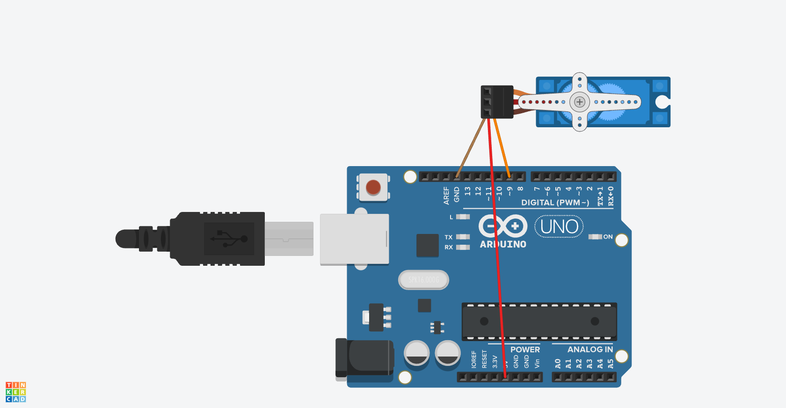

# Chapter7(サーボ)

## 概要

サーボを回転させる

## サーボの概要

- 180度回転させることができるモータの一種
- 茶コード: GNDへ接続
- 赤コード: 5Vへ接続
- 橙コード: Digitalポートへ接続

## 必要な部品

- Arduino Uno R3 x1
- Servo x1
- M-M wires x3

## 回路図



## プログラム

```cpp
#include <Servo.h>

Servo myservo;

int angle = 0;

void setup() {
  myservo.attach(9);
}

void loop() {
  // 0度から180度まで回転させる
  for (angle = 0; angle <= 180; angle += 1) {
    myservo.write(angle);
    delay(15);
  }
  // 180度から0度まで回転させる
  for (angle = 180; angle >= 0; angle -= 1) {
    myservo.write(angle);
    delay(15);
  }
}
```

## 動作

このプログラムを動作させると、サーボが0度から180度まで回転したあとに元の位置に戻った。delayの値によって回転速度が変化する。
