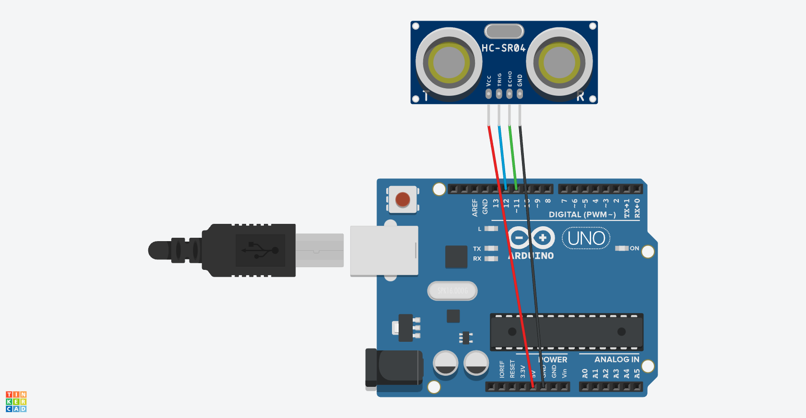

# Chapter8(超音波センサ)

## 概要

超音波センサを利用して距離を測定する

## 超音波センサの概要

- 超音波センサはHC-SR04を利用
- 2cm〜400cmを測定可能

## 必要な部品

- Arduino Uno R3 x1
- Ultrasonic sensor module x1
- F-M wires x4

## 回路図



## プログラム

```cpp
#include "SR04.h"

#define ECHO_PIN 11
#define TRIG_PIN 12

SR04 sr04 = SR04(ECHO_PIN, TRIG_PIN);
long a;

void setup() {
   Serial.begin(9600);
   delay(1000);
}

void loop() {
   a = sr04.Distance();

   Serial.print(a);
   Serial.println("cm");
   
   delay(1000);
}
```

## 動作

このプログラムを動作させると、シリアルモニタに距離がcm単位で出力されることを確認した。

## 注意事項

をArduino IDEへincludeしないと動作しない
