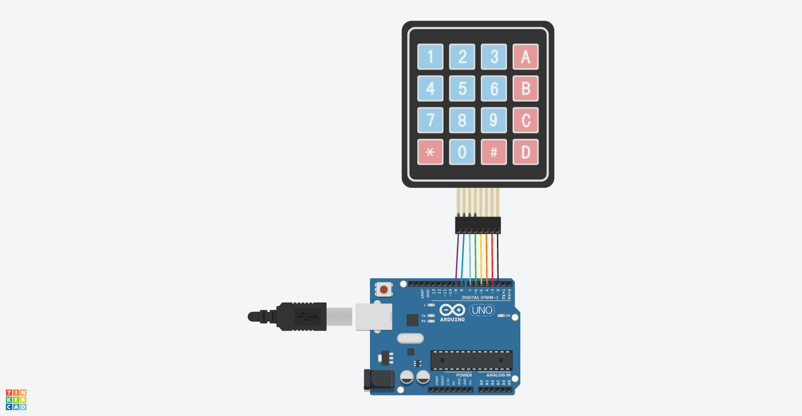

# Chapter9(膜スイッチ)

## 概要

膜スイッチを押下し、シリアルモニタに出力する

## 必要な部品

- Arduino Uno R3 x1
- Membrane switch x1
- M-M wires x8

## 回路図



## プログラム

```cpp
#include <Keypad.h>

const byte ROWS = 4;
const byte COLS = 4;

// 4バイトx4バイトの領域確保
char hexaKeys[ROWS][COLS] = {
  {'1','2','3','A'},
  {'4','5','6','B'},
  {'7','8','9','C'},
  {'*','0','#','D'}
};

// 2ピンから9ピンまでを利用する
byte rowPins[ROWS] = {9, 8, 7, 6};
byte colPins[COLS] = {5, 4, 3, 2};

Keypad customKeypad = Keypad( makeKeymap(hexaKeys), rowPins, colPins, ROWS, COLS); 

void setup(){
  Serial.begin(9600);
}
  
void loop(){
  char customKey = customKeypad.getKey();
  
  if (customKey){
    Serial.println(customKey);
  }
}
```

## 動作

このプログラムを動作させ、膜スイッチを押下するとそれに対応した文字がシリアルモニタに出力されることを確認した
